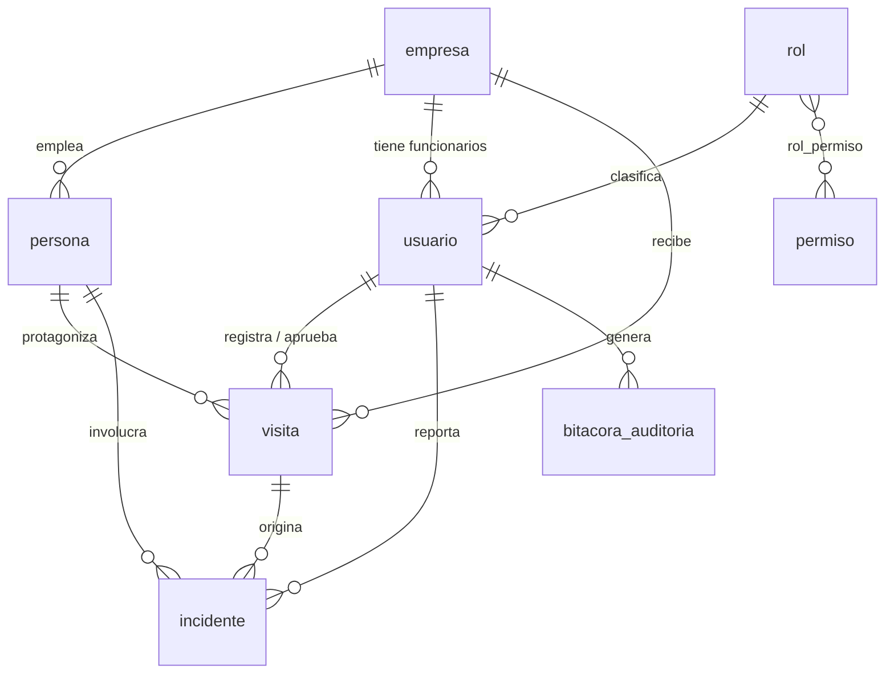

# SICA — Sistema Integrado de Control de Acceso

Control de acceso para el complejo empresarial **Zona Acme**: 30+ empresas, una
porteria, y hasta hoy un libro de papel y un radio.

Aplicacion de escritorio en **Java 17 + JavaFX**, persistencia en **MySQL 8** con
**JDBC puro**, sin frameworks de aplicacion.

---

## 1. El problema

El registro manual tiene tres fallas que el sistema ataca de frente:

| Problema del proceso actual | Como lo resuelve SICA |
|---|---|
| En una evacuacion nadie sabe quien esta adentro | Tablero de ocupacion en vivo, consultable en cualquier momento |
| El guarda decide de memoria a quien deja entrar | El dominio emite un **veredicto** con una sola palabra y una instruccion |
| El libro de papel se puede alterar o arrancar una hoja | Bitacora **encadenada por hash SHA-256**: alterar o borrar una linea rompe la cadena y el sistema lo reporta |

---

## 2. Los cuatro flujos de porteria

1. **Invitado pre-registrado.** El anfitrion dejo la visita aprobada. El guarda
   teclea el documento y el sistema responde `AUTORIZADO`.
2. **Invitado no anunciado.** No hay visita previa. Se envia una solicitud al
   funcionario anfitrion, que aprueba o rechaza **en tiempo real**.
3. **Trabajador sin carnet.** Se identifica con documento y requiere el visto
   bueno del anfitrion antes de entrar.
4. **Salida olvidada.** La persona figura `DENTRO` de un ingreso anterior que
   nunca se cerro. El sistema cierra esa visita y abre la nueva **en una sola
   transaccion**, y deja constancia en la bitacora.

El flujo 4 existe para sostener el invariante central del sistema:

> **Una persona no puede tener mas de una visita en estado `DENTRO` al mismo tiempo.**

Sin esa garantia el tablero de ocupacion miente, y si el tablero miente no sirve
para una evacuacion.

---

## 3. Arquitectura

**Hexagonal (puertos y adaptadores) con organizacion en vertical slice.**
 
La idea central es una sola: **las dependencias apuntan siempre hacia adentro.**
El nucleo de negocio no sabe que existe MySQL, ni JavaFX, ni JDBC. Sabe que
existe *algo* que guarda visitas, y lo declara como una interfaz. Quien la
implementa es asunto de la periferia.
 
### Las tres capas
 
| Capa | Que contiene | De que NO puede depender |
|---|---|---|
| `dominio` | Reglas de negocio puras: `Visita`, `EstadoVisita`, `Veredicto` | De nada. Solo Java estandar. |
| `aplicacion` | Casos de uso y **puertos** (interfaces) | De infraestructura ni de la interfaz grafica |
| `infraestructura` | **Adaptadores**: JDBC, bus de eventos | Depende hacia adentro, nunca al reves |
 
Fuera de esas tres estan `ui` (adaptador de entrada, JavaFX) y `arranque`
(la raiz de composicion, donde se conecta todo).
 
### Puertos y adaptadores
 
Un **puerto** es una interfaz que la capa de aplicacion declara con lo que
necesita. Un **adaptador** es la implementacion concreta que vive afuera.
 
```
RegistrarIngresoService  ──depende de──>  RepositorioVisitas   (puerto, interfaz)
                                                  ▲
                                                  │ implementa
                                          JdbcRepositorioVisitas (adaptador)
```
 
El caso de uso nunca nombra a `JdbcRepositorioVisitas`. Recibe un
`RepositorioVisitas` por constructor y no sabe si detras hay MySQL, un archivo
o una lista en memoria.
 
El proyecto tiene **10 puertos** y **10 adaptadores** (9 de JDBC y el bus de
eventos en memoria).
 
### La raiz de composicion
 
Los adaptadores se instancian en **un solo lugar**: `ContextoAplicacion`. Es lo
que hace posible que el resto del codigo dependa solo de interfaces. Ningun
servicio ni ninguna pantalla hace `new JdbcRepositorioVisitas()`.
 
### Como se verifica que la regla se cumple
 
No hace falta creer en la palabra: se puede comprobar. Estos cuatro comandos
recorren el codigo fuente buscando violaciones de la regla de dependencia.
 
```bash
# 1. El dominio no puede conocer JDBC, JavaFX ni infraestructura
grep -rn "^import" --include=*.java */dominio/ | grep -E "java.sql|javafx|infraestructura"
 
# 2. La capa de aplicacion tampoco
grep -rn "^import" --include=*.java */aplicacion/ | grep -E "java.sql|javafx"
 
# 3. JDBC solo puede vivir en los adaptadores
grep -rln "import java.sql" --include=*.java . | grep -v infraestructura
 
# 4. Ningun caso de uso instancia un adaptador
grep -rn "new Jdbc" --include=*.java */aplicacion/ ui/
```
 
**Los cuatro devuelven vacio.** Esa es la definicion operativa de "es
hexagonal": no que el codigo este en carpetas con esos nombres, sino que las
flechas de dependencia solo apunten hacia adentro.
 
La unica excepcion aparente es `Main.java`, que importa JavaFX porque extiende
`Application`. Es el punto de entrada del programa y su trabajo es precisamente
arrancar el adaptador de interfaz; no es una violacion de la regla.
 
### Vertical slice
 
Dentro de esa arquitectura, el codigo se organiza **primero por capacidad de
negocio y despues por capa**. En vez de un paquete `repositorios` con todos los
repositorios juntos, hay un paquete `acceso` que contiene su propio dominio,
sus puertos y sus adaptadores.
 
La ventaja practica: para cambiar como funciona la porteria, todo lo que hay que
tocar esta en una carpeta.
 
### Estructura
 
**Hexagonal + vertical slice.** El codigo se organiza primero por capacidad de
negocio, y dentro de cada capacidad por capa:
 
```
com.zonaacme.sica
├── acceso/              <- slice: porteria y visitas
│   ├── dominio/             reglas puras, sin JDBC ni JavaFX
│   ├── aplicacion/          casos de uso + PUERTOS (interfaces)
│   └── infraestructura/     ADAPTADORES JDBC
├── personas/            <- slice: directorio y restricciones de ingreso
├── incidentes/          <- slice: reportes de seguridad
├── reportes/            <- slice: agregaciones y exportacion
├── directorio/          <- slice: empresas y anfitriones
├── usuarios/            <- slice: autenticacion y RBAC
├── shared/              <- nucleo transversal
│   ├── dominio/             excepciones, evento base
│   ├── seguridad/           hash de claves, sesion, usuario autenticado
│   ├── auditoria/           puerto de bitacora
│   ├── eventos/             bus de eventos en memoria
│   ├── aplicacion/          CasoDeUso, decoradores, transacciones
│   └── infraestructura/     conexion, adaptador de bitacora, hash
├── arranque/            <- raiz de composicion (ContextoAplicacion, Main)
└── ui/                  <- adaptadores de entrada JavaFX
```
 
**La regla de dependencia:** `dominio` no importa nada de `infraestructura` ni de
`ui`. Las flechas apuntan siempre hacia adentro. `aplicacion` define interfaces
(`RepositorioVisitas`, `Bitacora`, `PublicadorEventos`) y `infraestructura` las
implementa.
 
Para no romper esa regla en las transacciones existe `ContextoTransaccion`, una
interfaz marcadora vacia que viaja por las firmas de los puertos. Asi la capa de
aplicacion coordina transacciones **sin importar nunca `java.sql.Connection`**.
Solo `ContextoJdbc` la desempaca.

---

## 4. Patrones de diseno

Tres patrones, cada uno resolviendo un requisito explicito del enunciado.

### Decorator — RBAC y auditoria

El enunciado pide que **todo** caso de uso valide permisos y deje rastro en la
bitacora. Ponerlo dentro de cada servicio seria repetir el mismo bloque 20 veces
y mezclar tres responsabilidades en una clase.

```java
return decoradores
        .envolver(new RegistrarIngresoService(...))
        .conPermiso("registrar_visita")
        .auditando("REGISTRAR_INGRESO", "visita", ...)
        .construir();
```

El orden es `auditoria(seguridad(servicio))`, y **es deliberado**: la auditoria
queda por fuera para que los intentos *denegados* tambien se registren. Un
sistema que solo audita lo que salio bien no sirve para investigar un incidente.

### State — ciclo de vida de la visita

`EstadoVisita` es un enum con las transiciones permitidas declaradas en el propio
estado. `Visita` no tiene setters: solo metodos de negocio (`registrarIngreso`,
`cerrarPorSalidaOlvidada`) que preguntan al estado si la transicion es legal. Un
estado imposible no se puede construir.

### Observer — tiempo real

`PublicadorEventos` es un puerto; `BusEventosEnMemoria` el adaptador. Cuando un
guarda crea una solicitud, la pantalla del funcionario se entera sin consultar la
base de datos en un ciclo.

Los eventos se publican **despues del commit**, nunca dentro de la transaccion.
Notificar algo que despues hace rollback deja la interfaz mintiendo.

### Ademas

- **Builder** en `FabricaDecoradores`, para que armar un caso de uso se lea como una frase.
- **Factory** en las fabricas estaticas de `Visita`, una por flujo de porteria.

---

## 5. SOLID en decisiones concretas

- **S** — `RegistrarIngresoService` solo coordina el ingreso. Permisos y bitacora viven en decoradores aparte. linea 35
- **O** — Agregar auditoria a un caso de uso no obliga a modificar el servicio: se envuelve.
- **L** — Todos los casos de uso implementan `CasoDeUso<E,S>` y son intercambiables; los decoradores tambien lo implementan. quien recibe un caso de uso no sabe ni le importa si le llego un serviciio pelado o envuelto dos veces. linea 21 y 24
- **I** — Puertos pequenos y por slice. `ConsultaPorteria` y `RepositorioVisitas` estan separados porque uno es lectura de porteria y el otro escritura de visitas.
- **D** — `RegistrarIngresoService` depende de la interfaz `RepositorioVisitas`, no de `JdbcRepositorioVisitas`. El cableado ocurre solo en `ContextoAplicacion`.

---

## 6. Programacion funcional

**Lambdas.** `CasoDeUso<E,S>` es una interfaz funcional, y es lo que permite que
los decoradores envuelvan cualquier caso de uso sin escribir uno por operacion.
Las descripciones de auditoria se declaran como lambdas en la raiz de
composicion, de modo que cada caso de uso decide que contar sin que el decorador
tenga que conocerlo. " contextoAplicacion.java linea 33 y 62 "

**Stream API.** El modulo de reportes esta construido sobre streams, y la
eleccion tiene una razon concreta: sobre el **mismo** conjunto de filas se
calculan seis cortes distintos (por empresa, por tipo, por estado, por hora,
promedio de estancia, top de estancias largas). Resolverlos con `GROUP BY` seria
seis consultas sobre exactamente los mismos datos. Se trae el detalle una vez
—filtrado e indexado por SQL, que es lo que SQL hace bien— y se agrega en
memoria. "GenerarReportesVisitasService.java" linea 71

Colectores en uso: `groupingBy`, `counting`, `averagingLong`, `toMap`,
`joining`, ademas de `flatMap`, `sorted` y `limit`.

Dos detalles que valen la pena:

- Los agrupamientos vuelcan a `LinkedHashMap` explicitamente. `groupingBy`
  entrega un `HashMap`, que **no garantiza orden**, asi que ordenar antes de
  agrupar no sirve de nada: el mapa reordena las claves por su cuenta.
- El corte por hora se ordena por hora y no por volumen, porque ahi interesa la
  forma de la curva a lo largo del dia. Ordenarlo por cantidad destruiria
  justamente el patron que se busca.

El limite de este enfoque es la memoria: con millones de visitas habria que
empujar las agregaciones de vuelta a SQL o usar vistas materializadas. Para un
complejo de 30 empresas, el detalle de un mes cabe holgadamente.

---

## 7. Bitacora encadenada por hash

Cada registro guarda `hash_anterior` y `hash_actual`, donde:

```
hash_actual = SHA256(hash_anterior + id + usuario + accion + entidad + detalle + resultado + terminal + fecha)
```

El primer registro encadena contra un hash **genesis** de 64 ceros.

Si alguien edita una fila vieja directamente en MySQL, su contenido deja de
coincidir con su hash y el verificador reporta el numero exacto del registro
alterado. Si alguien **borra** una fila, el siguiente registro queda apuntando a
un hash que ya no existe y la cadena se rompe igual.

Comprobado en pruebas contra base de datos real:

```
Antes de tocar nada  -> INTACTA  Cadena integra. Se verificaron 10 registros.
Editar el registro 6 -> ROTA     Cadena de integridad ROTA en el registro #6.
Borrar el registro 9 -> ROTA     Cadena de integridad ROTA en el registro #10.
```

Detalle de implementacion: `JdbcBitacora` usa **su propia conexion**, separada de
la transaccion de negocio. Si el ingreso falla y hace rollback, el intento debe
quedar registrado de todos modos.

---

## 8. Modelo de datos

### Sobre el modelo entregado por el docente

Este esquema **parte del modelo de datos entregado en clase**. Se conservan sus
nombres de tablas, de columnas y sus relaciones, incluida la normalizacion de
los estados en las tablas `persona_estados_acceso` y `visita_estados`.

Se agregaron columnas donde los flujos exigidos por el enunciado no eran
implementables sin ellas. Cada una esta marcada con `[+]` en `schema.sql` junto
a su justificacion. Las tres de fondo:

1. **`visitas` necesita `tipo_visita`, `empresa_destino_id` y `motivo`.** Sin
   ellas los flujos 2 y 3 no se pueden implementar: no habria a quien notificar
   ni que mostrarle al anfitrion para que decida.
2. **`bitacora_auditoria` necesita `usuario_intento`.** El enunciado pide
   auditar los intentos de login fallidos, pero en un login fallido no hay
   usuario autenticado: `usuario_id` queda nulo y se perderia el dato mas
   importante, que es que cuenta se intento usar.
3. **`bitacora_auditoria` encadena hashes.** Es lo que convierte "bitacora
   inmutable" en una propiedad verificable.

La columna `usuarios.password` conserva su nombre del modelo original. El propio
modelo anotaba que *deberia* ser un hash; se implemento asi.

### Normalizacion

El esquema esta en **tercera forma normal**:

- **1FN** — todas las tablas tienen clave primaria y valores atomicos.
- **2FN** — la unica clave compuesta es `rol_permisos`, sin atributos fuera de la clave.
- **3FN** — sin dependencias transitivas. Los estados estan normalizados en
  `persona_estados_acceso` y `visita_estados`, hay **17 llaves foraneas** y todas
  estan indexadas. Todas las tablas son InnoDB.

Hay **dos denormalizaciones deliberadas**, ambas en la bitacora:

1. **Se guarda texto ademas de referencias** (`usuario_intento`, y nombres dentro
   de `detalles`). Una bitacora es una fotografia del momento: si guardara solo
   el identificador y el usuario despues cambia de nombre o se elimina, el
   registro historico cambiaria de significado retroactivamente. Una bitacora que
   cambia no sirve como evidencia.
2. **`hash_anterior` y `hash_actual` son datos derivados.** Se podrian recalcular,
   pero entonces no habria contra que comparar. El punto es que el valor quede
   congelado.

### Una nota sobre la arquitectura

El cambio de modelo de datos ocurrio con el proyecto ya avanzado. Migrarlo
implico reescribir los cuatro adaptadores JDBC y los scripts SQL.

**El dominio y la capa de aplicacion no cambiaron ni una linea.** Las reglas de
acceso, la maquina de estados de la visita, los decoradores de seguridad y
auditoria, y los cuatro casos de uso siguieron compilando y pasando sus pruebas
sin modificacion alguna.

Esa es exactamente la propiedad que se buscaba al elegir arquitectura hexagonal,
y el historial de Git lo documenta.



Nueve tablas, todas `InnoDB` (obligatorio: MyISAM **ignora las transacciones en
silencio**, y el flujo 4 dejaria de ser atomico sin avisar).

Los permisos viven en la tabla `permiso` y se asocian a roles en `rol_permiso`.
**Ningun permiso esta escrito en el codigo Java**: crear el rol `SUPERVISOR` fue
un `INSERT`, sin recompilar nada.

`v_ocupacion_actual` es una vista que alimenta el tablero de quien esta adentro.

**Nota sobre el invariante:** MySQL no soporta indices unicos parciales, asi que
"una sola visita `DENTRO` por persona" no se puede declarar en el esquema. Se
hace cumplir en la capa de servicio con `SELECT ... FOR UPDATE` dentro de la
transaccion, lo que ademas bloquea la fila y evita que dos guardas registrando a
la misma persona al tiempo creen dos visitas abiertas.

---

## 9. Instalacion

### Requisitos

- JDK 17 o superior
- MySQL 8
- Maven 3.8+

### Pasos

```bash
# 1. Crear el esquema y los datos
mysql -u root -p < src/main/resources/db/schema.sql
mysql -u root -p < src/main/resources/db/data.sql

# 2. Configurar la conexion
cp src/main/resources/config.properties.example src/main/resources/config.properties
#    y editar db.usuario y db.password

# 3. Ejecutar
mvn javafx:run
```

`config.properties` esta en `.gitignore`: las credenciales no viajan al repositorio.

Los tres parametros de la URL JDBC no son opcionales en MySQL 8:

```
jdbc:mysql://localhost:3306/sica?serverTimezone=America/Bogota&useSSL=false&allowPublicKeyRetrieval=true
```

Sin `serverTimezone` las marcas de tiempo de la bitacora y de los check-in
quedan desfasadas, y la bitacora pierde valor como evidencia.

---

## 10. Credenciales de prueba

El inicio de sesion usa el **correo**, que es la columna unica de la tabla `usuarios`.

| Correo | Clave | Rol | Para que sirve en la demo |
|---|---|---|---|
| `admin@zonaacme.co` | `Admin123*` | Superusuario | Administracion, usuarios, bitacora |
| `hrincon@zonaacme.co` | `Guarda123*` | Guarda de Seguridad | Porteria: los cuatro flujos |
| `ncastillo@zonaacme.co` | `Guarda123*` | Guarda de Seguridad | Segunda garita, para probar concurrencia |
| `mrodriguez@nexoanalytics.co` | `Funciona123*` | Funcionario de Empresa | Anfitriona en Nexo Analytics |
| `lgomez@lumenstudio.co` | `Funciona123*` | Funcionario de Empresa | Anfitrion en Lumen Studio |
| `palvarez@zonaacme.co` | `Super123*` | Supervisor de Seguridad | Incidentes, reportes y auditoria |

Las claves se almacenan con **PBKDF2-HMAC-SHA256, 120.000 iteraciones**, salt
aleatorio por usuario y comparacion en tiempo constante. Se uso `javax.crypto`
del JDK en lugar de BCrypt para respetar la restriccion de Java puro.

### Documentos para probar los flujos

| Documento | Persona | Flujo |
|---|---|---|
| `1020304050` | Camila Restrepo | 1 — invitada pre-registrada, `AUTORIZADO` |
| `1088776655` | Valentina Nieto | 2 — invitada no anunciada, requiere autorizacion |
| `1015234567` | Andres Mejia | 3 — trabajador sin carnet |
| `1032998877` | Juliana Torres | 4 — figura `Dentro` desde hace 26 horas |
| `1011223344` | Oscar Pineda | Persona con prohibicion de ingreso |
| `9999999999` | (no existe) | Veredicto `NO REGISTRADO` |

La bitacora arranca **vacia a proposito**: debe llenarse desde Java, no desde el
`data.sql`.

---

## 11. hilos

el pool del bus de eventos BusEventosEnMemoria, ln35
quien publica un evento no se quede esperando a que todos los suscriptores terminen y para que no impidan cerrar la aplicacion

ventanalogin.java ln202
El login verifica un hash de 120.000 iteraciones pero tarda mucho tiempo y sumado el viaje a la base de datos hacerlo en el hilo de javafx congelaria la ventana en cada intento.


## 12. Git Flow

`main` (produccion) y `develop` (integracion), con ramas `feature/*` que se
integran con `--no-ff` para que el grafo conserve la forma del flujo.

Commits siguiendo **Conventional Commits** (`feat:`, `fix:`, `docs:`, `refactor:`).

---


## 13. config.properties

db.url=jdbc:mysql://localhost:3307/sica?serverTimezone=America/Bogota&useSSL=false&allowPublicKeyRetrieval=true
db.usuario=campus
db.password=campus123
app.terminal=UNIVERSIDAD

## 14. 1.Abrir una terminal en la carpeta donde está pom.xml y ejecutar:

docker compose down -v
docker compose up -d

Revisar que este creada
docker compose ps
docker compose logs mysql

Confirmar que sí existen las tablas

Ejecutar:

docker compose exec mysql mysql -ucampus -pcampus123 -e "USE sica; SHOW TABLES;"

2.Iniciar la aplicación
Desde la carpeta donde está pom.xml:
mvn clean javafx:run